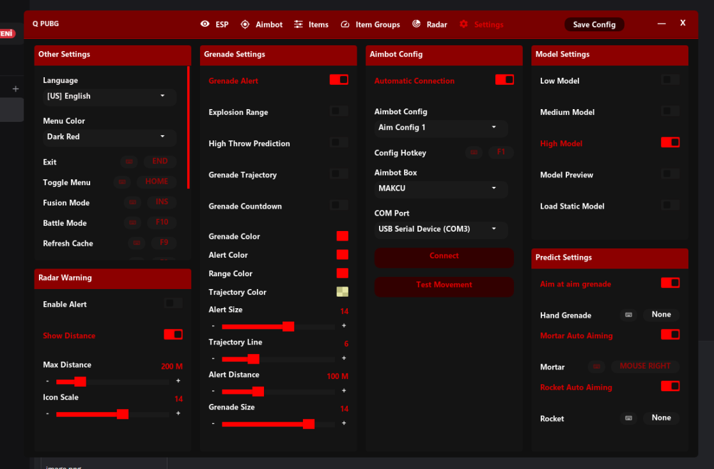
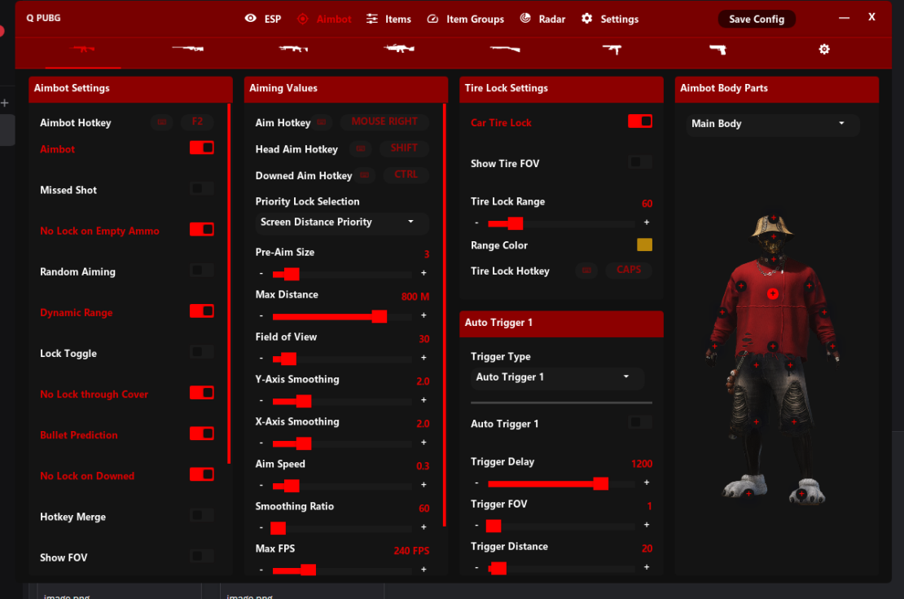
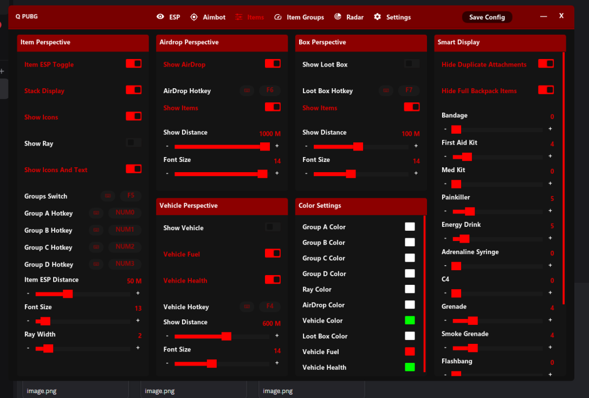

<h1 align="center">Q PUBG DMA</h1>

  
  

  
  

---

## Thank You for Using My Software

- **The software is updated whenever I am available.**  
  Please do **not** ask for updates — repeated requests will be ignored.

- **This project is currently completely FREE.**  
  I do not make any money from it at this time.

- **You may ask questions via support requests**,  
  but please be respectful and avoid causing inconvenience.  
  Otherwise, I may stop sharing this project.

---

## 🎮 PUBG DMA SOFTWARE

- You can find the required **Dependencies** and the **Q PUBG DMA EXE** below.

---

## 📦 INSTALLATION STEPS

1. Download the **Dependencies** files.
2. Download the **Q PUBG DMA EXE**.
3. Place both files in the **same folder**.
4. Run the **Q PUBG DMA EXE**.

---

## ❗ IMPORTANT NOTES

- The software is currently **FREE**.
- In most updates, **only the EXE file is updated**.  
  You usually do **not** need to re-download the dependencies.
- All updates are shared in the Discord channel.

---

## 💬 COMMUNITY & SUPPORT

Join our Discord server for:
- Updates  
- Support  
- Announcements  

  

---

## ⚠ DISCLAIMER

This project is provided for **educational and research purposes only**.  
The author takes **no responsibility** for misuse or any violations of a game's
terms of service.

**Use at your own risk.**

## CREDITS

- https://github.com/ufrisk/pcileech
- Scarlet DMA (https://scarlet.technology/)
- DoubleAI
- @breadthedev
- dreamyduck
